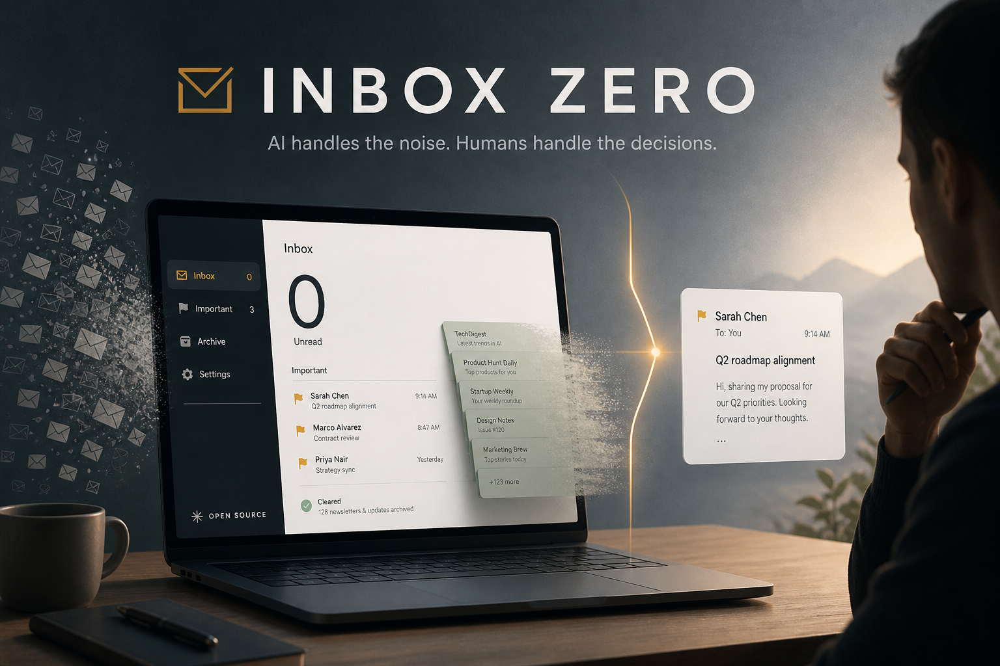
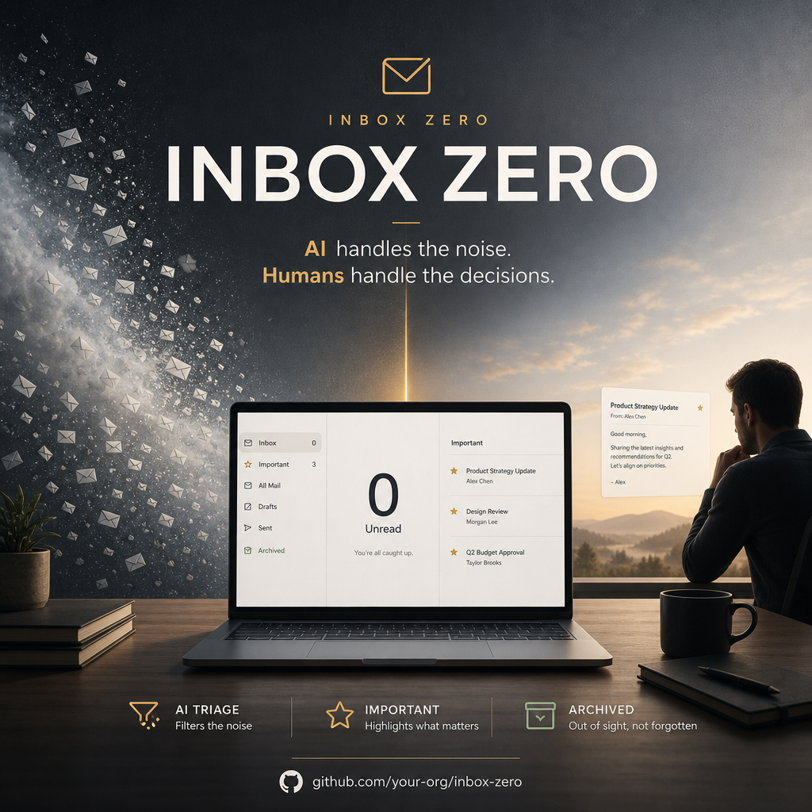

# Inbox Zero



**AI handles the noise. Humans handle the decisions.**

An autonomous email operations skill for Cursor: classify incoming mail, run safe organization actions through an email MCP, draft replies, and escalate only what needs human judgment.

| Target | Goal |
|--------|------|
| Unread | 0 |
| Actionable | under 5 |
| Categorized | 100% |

## Install

Copy the skill into a Cursor skills path:

```bash
# Personal (all projects)
cp -R inbox-zero ~/.cursor/skills/inbox-zero

# Or project-scoped
mkdir -p .cursor/skills
cp -R inbox-zero .cursor/skills/inbox-zero
```

Restart or open a new Agent chat so Cursor rescans skills.

## Configure email MCP (required)

Live triage **requires** an email MCP with list/search, read, and label or archive tools.

Follow **[setup.md](setup.md)** before first use. Until that passes smoke tests, the skill will stop and point you here — it will not invent inbox contents.

Optional preferences:

```bash
cp ~/.cursor/skills/inbox-zero/preferences.example.yaml ~/inbox-zero.preferences.yaml
```

Edit important contacts, work hours, and keep `send_replies: false` until you trust drafts.

## Use

In Agent chat:

- `/inbox-zero` or “Inbox zero — morning briefing”
- “Triage my unread email”
- “Always notify me about emails from my accountant”

Default behavior: draft replies, never auto-send; never auto-approve money, contracts, legal, or conflict threads.

## What’s in this folder

| File | Purpose |
|------|---------|
| [SKILL.md](SKILL.md) | Agent workflow, decision engine, safety rules |
| [setup.md](setup.md) | Email MCP install + smoke test |
| [preferences.example.yaml](preferences.example.yaml) | Escalation and automation defaults |
| [reference.md](reference.md) | Intent cues, templates, safe/unsafe actions |
| [assets/](assets/) | Marketing images for docs and social |

## Assets

| File | Use |
|------|-----|
| [assets/inbox-zero-skill-marketing.png](assets/inbox-zero-skill-marketing.png) | 16:9 README / release hero |
| [assets/inbox-zero-skill-social.png](assets/inbox-zero-skill-social.png) | 1:1 GitHub / social preview |


